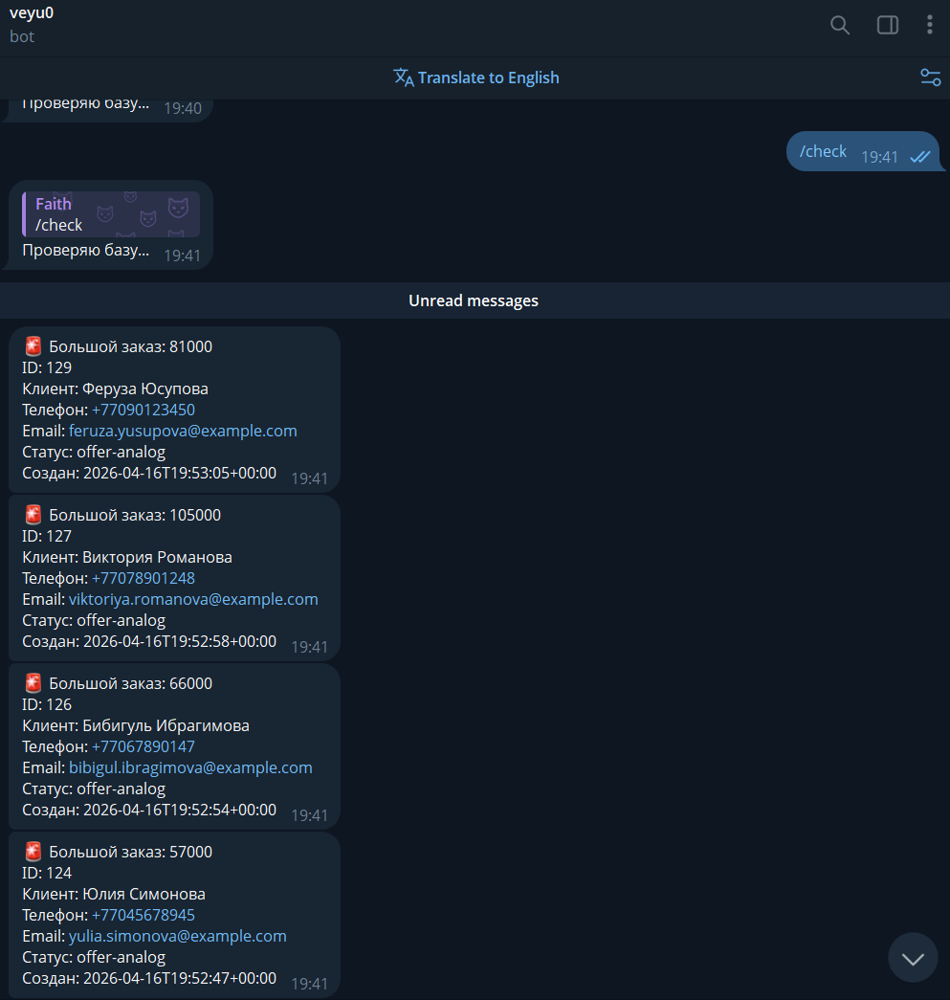

# Тестовое задание — AI Tools Specialist

## Скриншот уведомления в Telegram

Ниже вставлен пример скриншота уведомления от бота.

## Промпты, отладка и как решалось

Ниже — заметки по взаимодействию с Claude Code / AI-инструментом, основные промпты, где встали и как решили проблемы.

- Промпты, которые давались чаще всего (примерные формулировки):
	- "Напиши скрипт на Python, который загрузит заказы из `mock_orders.json` в RetailCRM через API."
	- "Напиши скрипт, который забирает заказы из RetailCRM и вставляет их в таблицу `orders` в Supabase (supabase-py)."
	- "Сделай Streamlit-дашборд, который строит график сумм заказов по датам и показывает распределение по статусам и городам."
	- "Напиши Telegram-бота на aiogram, который проверяет таблицу `orders` в Supabase и шлёт уведомление, если сумма заказа больше 50000." 

- Где возникали проблемы и как их решили:
	1. Ошибка с `orderType` при загрузке в RetailCRM — RetailCRM возвращал 400. Решение: проверил `mock_orders.json`, исправил поле `orderType` на допустимое значение (например, "main"), переслал заказы по одному.
	2. Попытка создать таблицу в Supabase программно через RPC (`execute_sql`) завершалась ошибкой — Supabase по умолчанию не предоставляет такую RPC-функцию. Решение: сгенерировал и положил в README SQL CREATE TABLE для ручного выполнения в SQL-редакторе Supabase; добавил указания по RLS (политика вставки) или использование service_role ключа для миграций.
    3. Интеграция Altair + Jinja2 (попытка рендерить чарты в FastAPI-шаблонах) — при передаче `.to_html()` возникали несовместимости (тип/inline). Решение: упростил подход — дашборд оставил в Streamlit и сделал FastAPI минимумом (редирект), либо опционально можно встраивать chart.to_html(inline=True) как строку.

- Дополнительные мелочи и рекомендации:
	- Для устойчивой записи состояния (чтобы не шлёться одинаковые уведомления повторно) можно создать в Supabase таблицу `notified_orders` и делать upsert, либо использовать Redis/в памяти TTL-кеш.
	- RLS-политики Supabase могут блокировать вставку/чтение — при разработке удобно временно включить permissive policy или использовать service_role для миграций.
